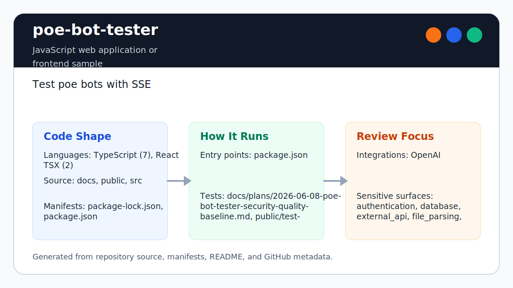

# poe-bot-tester

<!-- README-OVERVIEW-IMAGE -->


## Overview

`garethpaul/poe-bot-tester` is a JavaScript web application or frontend sample. Test poe bots with SSE 

This README is based on the checked-in source, manifests, scripts, and repository metadata on the `main` branch. The project language mix found during review was: TypeScript (7), React TSX (2).

## Repository Contents

- `README.md` - project overview and local usage notes
- `Makefile` - repository-level verification wrapper
- `package.json` - JavaScript dependency and script metadata
- `docs` - source or example code
- `package-lock.json` - JavaScript dependency and script metadata
- `public` - source or example code
- `scripts` - deterministic maintenance and regression checks
- `SECURITY.md` - security reporting and disclosure guidance
- `src` - source or example code
- `VISION.md` - project direction and maintenance guardrails

Additional scan context:

- Source directories: docs, public, src
- Dependency and build manifests: package-lock.json, package.json
- Entry points or build surfaces: package.json, Makefile
- Test-looking files: docs/plans/2026-06-08-analyze-bot-helper-tests.md, docs/plans/2026-06-08-poe-bot-tester-security-quality-baseline.md, public/test-files/test.html, public/test-files/test.txt, scripts/test-analyze-bot.ts, src/app/api/test-bot/route.ts, src/app/api/test-files/route.ts

## Getting Started

### Prerequisites

- Git
- Node.js and npm

### Setup

```bash
git clone https://github.com/garethpaul/poe-bot-tester.git
cd poe-bot-tester
npm ci
```

The setup commands above are derived from repository files. Legacy mobile, Python, or JavaScript samples may require older SDKs or package versions than a modern workstation uses by default.

## Running or Using the Project

- Run `npm start` for the default development command.
- Run `npm run dev` for the development server when that script is appropriate.

Detected npm scripts:

- `npm run audit` - `npm audit --audit-level=moderate`
- `npm run build` - `next build`
- `npm run dev` - `next dev --turbopack`
- `npm run lint` - `eslint .`
- `npm run start` - `next start`
- `npm run test` - `tsx scripts/test-analyze-bot.ts`
- `npm run typecheck` - `tsc --noEmit`
- `npm run verify` - `npm run lint && npm run typecheck && npm test && npm run build && npm run audit`

## Testing and Verification

- Run `npm test` for deterministic analyzer helper regression coverage.
- Description scoring treats documented parameters and documented `cannot`
  limitations as full passing evidence across analyzer paths.
- Order-independent Poe metadata parsing keeps description and profile image
  extraction stable when meta tag attributes are reordered.
- Blank bot descriptions are trimmed before scoring so whitespace cannot pass
  description clarity checks.
- API route tests reject blank API keys and prompts before upstream Poe fetches.
- Chunked analysis rejects invalid chunk indexes before opening SSE streams.
- Deterministic streaming analyzer scoring avoids random pass/fail output for
  simulated checks that still need live Poe verification.
- Run `make check` before committing; it delegates to `npm run verify`, which
  runs lint, TypeScript checking, tests, the production build, and dependency
  audit.
- `npm run build` removes stale `tsconfig.tsbuildinfo` first so repeated
  Next.js builds cannot reuse `.next/types` paths from an earlier build.

When the required SDK or runtime is unavailable, use static checks and source review first, then verify on a machine that has the matching platform toolchain.

## Configuration and Secrets

- Detected references to OpenAI. Keep API keys, OAuth credentials, tokens, and account-specific values in local configuration only.

## Security and Privacy Notes

- Review changes touching authentication or token handling; examples from the scan include src/app/api/analyze-bot/route.ts, src/app/api/analyze-bot-chunked/route.ts, src/app/page.tsx.
- Review changes touching external API calls or credential-adjacent configuration; examples from the scan include src/app/api/analyze-bot/route.ts, src/app/api/analyze-bot-chunked/route.ts, src/app/api/analyze-bot-stream/bot-analyzer.ts, src/app/api/analyze-bot-stream/route.ts, and 1 more.
- Review changes touching network requests, sockets, or service endpoints; examples from the scan include docs/plans/2026-06-08-poe-bot-tester-security-quality-baseline.md, src/app/api/analyze-bot/route.ts, src/app/api/analyze-bot-chunked/route.ts, src/app/api/analyze-bot-stream/bot-analyzer.ts, and 1 more.
- Review changes touching file, media, JSON, XML, CSV, OCR, or data parsing; examples from the scan include docs/plans/2026-06-08-poe-bot-tester-security-quality-baseline.md, src/app/api/analyze-bot/route.ts, src/app/api/analyze-bot-chunked/route.ts, src/app/api/analyze-bot-stream/bot-analyzer.ts, and 4 more.
- Review changes touching database, model, or persistence code; examples from the scan include src/app/api/analyze-bot/route.ts, src/app/api/analyze-bot-chunked/route.ts, src/app/api/analyze-bot-stream/bot-analyzer.ts.
- API routes validate Poe bot names before building upstream Poe URLs or model
  request payloads.
- API routes trim required user input and reject blank API keys and prompts
  before making Poe requests.
- Blank bot descriptions are treated as missing before description scoring.
- Chunked analysis rejects invalid chunked analysis indexes before creating
  progress streams.
- Streaming analyzer score output stays deterministic; simulated checks are
  marked as pending until live Poe verification is wired in.

## Maintenance Notes

- See `SECURITY.md` for vulnerability reporting and safe research guidance.
- See `VISION.md` for project direction and contribution guardrails.
- See `CHANGES.md` for maintenance history.
- See `docs/plans/2026-06-08-api-route-validation-tests.md` for App Router
  request-validation test coverage.
- See `docs/plans/2026-06-08-poe-bot-name-validation.md` for the bot-name
  validation baseline.
- See `docs/plans/2026-06-08-analyze-bot-helper-tests.md` for deterministic
  analyzer helper tests.
- See `docs/plans/2026-06-09-poe-bot-tester-description-score-alignment.md`
  for the description scoring alignment check.
- See `docs/plans/2026-06-09-poe-bot-tester-description-normalization.md`
  for blank bot description scoring.
- See `docs/plans/2026-06-09-poe-bot-tester-meta-attribute-order.md` for
  order-independent Poe metadata parsing.
- See `docs/plans/2026-06-09-poe-bot-tester-blank-input-validation.md` for
  required input validation.
- See `docs/plans/2026-06-09-poe-bot-tester-deterministic-stream-scores.md`
  for deterministic streaming analyzer scoring.
- See `docs/plans/2026-06-09-poe-bot-tester-chunk-index-validation.md` for
  chunked analysis index validation.
- See `docs/plans/2026-06-08-poe-bot-tester-check-wrapper.md` for the root
  check wrapper.

## Contributing

Keep changes small and tied to the project that is already present in this repository. For code changes, document the toolchain used, avoid committing generated dependency directories or local configuration, and update this README when setup or verification steps change.
